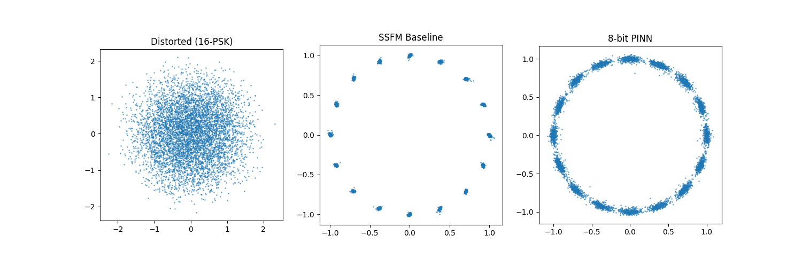

# FPGA-Accelerated Physics Informed Neural Network for Optical Fibre Communications (16-PSK)

This script trains a Physics Informed Neural Network (PINN) to recover 16-PSK signals received at the endpoint through optical fibre. Noise is introduced due to physical constraints described by the Non-Linear Schrodingers Equation (NLSE).

## Physics Background

The NLSE describes pulse propagation in optical fiber:

```
A_z = i * (beta2/2) * A_tt + i * gamma * |A|^2 * A
```

where `A(z,t)` is the complex envelope, `beta2` is the group-velocity dispersion parameter, and `gamma` is the Kerr nonlinear coefficient. Ground-truth solutions are generated via the symmetric Split-Step Fourier Method (SSFM).

## Project Structure

```
PINNs QAT/
├── PSK/
│   ├── pinn_psk.py          # 16-PSK Quantization Aware PINN Training and Conversion Script
│   ├── run_psk.py           # Reinforcement Learning Orchestrator Script
│   ├── README.md            # This file
│   └── results/             # Output directory
│       ├── psk_pinn_checkpoint.pth
│       ├── psk_raw.onnx
│       ├── psk_FINN_ready.onnx
│       └── constellation_comparison.png
│
├── shared/  ...             # See outer README.md
├── complex/ ...             # See outer README.md
└── README.md
```

## Environment Setup

To run this 16-PSK quantization aware (QA) PINN training script, a Python virtual enviornment is required. **The expected Python version is 3.12.1.**
It is expected that all commands should run from the project root directory. To begin, create a virtual enviornment by the following:
```bash
python -m venv env
```
Activate the enviornment by the following:
```bash
./env/scripts/activate/ # Windows
./env/bin/activate/     # macOS/Linux
```
Install the required dependencies by the following:
```bash
pip install --no-deps --ignore-requires-python -r complex/req.txt # Designed for CUDA-accelerated workflows
```
Flags are required as there are dependency and python version conflicts between packages. This has been tested to be functional for the script. The PSK script shares the same dependencies as `complex/` — refer to `complex/req.txt` or the outer `README.md` for the full dependency list.

## Quick Start

To begin, simply run the script by calling:
```bash
python PSK/pinn_psk.py
```
This will invoke training from scratch and will generate all available outputs (including metrics, visuals, checkpoints and exports).

Additional CLI options are available. Please run:
```bash
python PSK/pinn_psk.py --help
```
for more information.

## Reinforcement Training Quick Start

In order for the network to be able to predict the recovery for different input 16-PSK, reinforcement training is required. This can be done by calling:
```bash
python PSK/run_psk.py
```
This will invoke an initial 3000 epoch training, then 15 reinforcement training iterations at 250 epochs each, based on either default or CLI inputs.

Additional CLI options are available. Please run:
```bash
python PSK/run_psk.py --help
```
for more information.

## Architecture

The architecture of the model is as follows:

```
Input (W×2) → QuantIdentity → QuantLinear(W×2 → H) → QuantHardTanh
            → QuantIdentity → QuantLinear(H → H)   → QuantHardTanh  (×L)
            → QuantIdentity → QuantLinear(H → 2)   → Output (Re, Im)

W = window_size (25), H = hidden_dim (64), L = hlayers (3)
```

The input takes a flattened sliding window of complex symbols, doubled to account for both ``Re`` and ``Im`` components. The model uses `QuantHardTanh` instead of `Tanh` as FINN is unable to synthesize `nn.Tanh` (or `qnn.QuantTanh`) into hardware logic. `QuantHardTanh` clamps outputs to [-1, 1] and fuses the activation with requantization into a single FINN-synthesizable node. A `QuantIdentity` layer at the input quantizes the incoming (z, t) values before the first linear layer. The final linear layer funnels the 64-wide hidden dimension down to an output size of 2, representing the single corrected real and imaginary values of the target symbol.

## Output Metrics/Visuals

Running the model provides 2 sets of metrics and 1 set of visualisation. The metrics include EVM (Error Vector Magnitude) and SER (Symbol Error Rate). The visualisation shows the distorted, SSFM-recovered and PINN-recovered constellation diagram of the 16-PSK signal, with symbols normalised.

## Default Hyperparameters

| Parameter | Value | Description |
|-----------|-------|-------------|
| `epochs` | 3,000 | Training epochs |
| `lr` | 5e-4 | Learning rate |
| `bit_width` | 8 | Weight quantization bits |
| `act_bit_width` | 8 | Activation quantization bits |

## Results

Using the default hyperparameters and running the script to train from scratch, the following metrics were obtained:

```log
2026-03-17 01:15:06, 465 __main__ INFO: EVM Summary - Distorted: 105.50%, SSFM: 1.29%, PINN: 7.74%
2026-03-17 01:15:06, 475 __main__ INFO: SER Summary - Distorted: 87.97%, SSFM: 0.00%, PINN: 1.17%
```

The following visual was generated, which illustrates the successful recovery of 16-PSK.

