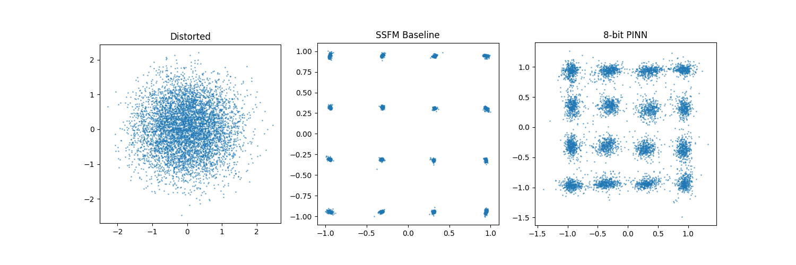

# FPGA-Accelerated Physics Informed Neural Network for Optical Fibre Communications (Complex Network)

This script trains a Physics Informed Neural Network (PINN) to recover 16-QAM signals received at the endpoint through optical fibre. Noise is introduced due to physical constraints described by the Non-Linear Schrodingers Equation (NLSE).

This file explains the 16-QAM version under ``complex/``. See ``readme.md`` files in other directories for explanations of adapted scripts and legacy scripts.

## Physics Background

The NLSE describes pulse propagation in optical fiber:

```
A_z = i * (beta2/2) * A_tt + i * gamma * |A|^2 * A
```

where `A(z,t)` is the complex envelope, `beta2` is the group-velocity dispersion parameter, and `gamma` is the Kerr nonlinear coefficient. Ground-truth solutions are generated via the symmetric Split-Step Fourier Method (SSFM).

## Project Structure

```
PINNs QAT/
├── complex/
│   ├── pinn_complex.py              # Complex Quantization Aware PINN Training and Conversion Script (16-QAM)
|   ├── run_complex.py               # Script for reinforcement training
│   ├── req.txt                      # Requirements to run complex pinn script
│   └── sample_results/              # Folder with generated sample for results + test pattern + accelerator inputs
│
├── APSK/                            # Complex PINN adaptation for 16-APSK
│   ├── pinn_apsk.py                 # Complex Quantization Aware PINN Training and Conversion Script (16-APSK)
|   ├── run_apsk.py                  # Script for reinforcement training
│   ├── sample_results/              # Folder with generated sample for results + test pattern + accelerator inputs        
│   └── readme.md                    # Readme file explaining adaptations
│
├── PSK/                             # Complex PINN adaptation for 16-PSK
│   ├── pinn_psk.py                  # Complex Quantization Aware PINN Training and Conversion Script (16-PSK)
|   ├── run_psk.py                   # Script for reinforcement training
│   ├── sample_results/              # Folder with generated sample for results + test pattern + accelerator inputs        
│   └── readme.md                    # Readme file explaining adaptations
│
├── STAR/                            # Complex PINN adaptation for STAR-QAM
│   ├── pinn_star.py                 # Complex Quantization Aware PINN Training and Conversion Script (STAR-QAM)
|   ├── run_star.py                  # Script for reinforcement training
│   ├── sample_results/              # Folder with generated sample for results + test pattern + accelerator inputs        
│   └── readme.md                    # Readme file explaining adaptations
│
├── qonnx2finn/
│   ├── qonnx2finn.py                # Function for FINN-ONNX export conversion
│   └── req.txt                      # FINN/QONNX dependencies [Only **IF** Running Independently]
│
├── legacy/                          # [DEPRECATED] Legacy simple guassian pulse scripts 
│
└── README.md                        # This file
```

## Environment Setup
To run this complex quantization aware (QA) PINN training script, a Python virtual enviornment is required. **The expected Python version is 3.12.1.**
It is expected that all commands should run from the project root directory. To begin, create a virtual enviornment by the following:
```bash
python -m venv env
```
Activate the enviornment by the following:
```bash
./env/scripts/activate/ # Windows
./env/bin/activate/     # macOS/Linux
```
Install the required dependencies by the following:
```bash
pip install --no-deps --ignore-requires-python -r complex/req.txt # Designed for CUDA-accelerated workflows
```
Flags are required as there are dependency and python version conflicts between packages. This has been tested to be functional for the script.

## Quick Start
To begin, simply run the script by calling:
```bash
python complex/pinn_complex.py
```
This will invoke training from scratch and will generate all available outputs (including metrics, visuals, checkpoints and exports).

Additional CLI options are available. Please run:
```bash
python complex/pinn_complex.py --help
```
for more information.

## Reinforcement Training Quick Start
In order for the network to be able to predict the recovery for different input 16-QAM, reinforcement training is required. This can be done by calling:
```bash
python complex/run_complex.py
```
This will invoke an initial 3000 epoch training, then reinforcement training of ``x`` iterations at ``y`` epochs each, based on either default or CLI inputs.

Additional CLI options are available. Please run:
```bash
python complex/run_complex.py --help
```
for more information.

## Generating deterministic inputs for accelerator, comparison and evaluation
To run the PINN on the accelerator, inputs must be specifically generated to match the required format for the PYNQ-ZU. Additionally, this input signal must be deterministic such that the results can be directly compared with the results from the SSFM-baseline and PINN on the computer. This input can be generated and saved by calling:
```bash
python complex/pinn_complex.py --load True --save_inputs True --onnx_export False --finn_convert False
```
This requires the trained network checkpoint, and generates ``generated_inputs.pkl`` containing the generated and distorted input signal, and ``accelerator_inputs.npy`` containing the input signal in a format recognisable by the Python script written to execute the PINN on the accelerator. If required, the metrics for this input can be regenerated by calling:
```bash
python complex/pinn_complex.py --load True --load_inputs True --onnx_export False --finn_convert False
```
This will load the inputs and regenerate both the metrics and the visual. Note that whilst the network and inputs remain the same, the outputs can still differ due to non-determinstic behavior in pytorch.

## Architecture

The architecture of the model is as follows:

```
Input (W×2) → QuantIdentity → QuantLinear(W×2 → H) → QuantHardTanh
            → QuantIdentity → QuantLinear(H → H)   → QuantHardTanh  (×L)
            → QuantIdentity → QuantLinear(H → 2)   → Output (Re, Im)

W = window_size, H = hidden_dim, L = hlayers
```

The input takes a flattened sliding window of complex symbols, doubled to account for both ``Re`` and ``Im`` components. The model uses `QuantHardTanh` instead of `Tanh` as FINN is unable to synthesize `nn.Tanh` (or `qnn.QuantTanh`) into hardware logic. `QuantHardTanh` clamps outputs to [-1, 1] and fuses the activation with requantization into a single FINN-synthesizable node. A `QuantIdentity` layer at the input quantizes the incoming (z, t) values before the first linear layer. The final linear layer funnels the 64-wide hidden dimension down to an output size of 2, representing the single corrected real and imaginary values of the target symbol.

## Output Metrics/Visuals

Running the model provides 2 sets of metrics and 1 set of visualisation. The metrics include EVM (Error Vector Magnitude) and SER (Symbol Error Rate). The visualisation shows the distorted, SSFM-recovered and PINN-recovered constellation diagram of the 16-QAM signal, with symbols normalised.

## Default Hyperparameters

| Parameter | Value | Description |
|-----------|-------|-------------|
| `epochs` | 3,000 | Training epochs |
| `lr` | 5e-4 | Learning rate |
| `bit_width` | 8 | Weight quantization bits |
| `act_bit_width` | 8 | Activation quantization bits |

## Results
Using the default hyperparameters and running the script to train from scratch, the following metrics were obtained:

```log
2026-03-15 01:47:19, 908 __main__ INFO: EVM Summary - Distorted: 108.57%, SSFM: 1.51%, PINN: 13.96%
2026-03-15 01:47:19, 915 __main__ INFO: SER Summary - Distorted: 88.58%, SSFM: 0.00%, PINN: 2.20%
```

The following visual was generated, which illustrates the successful recovery of 16-QAM.
