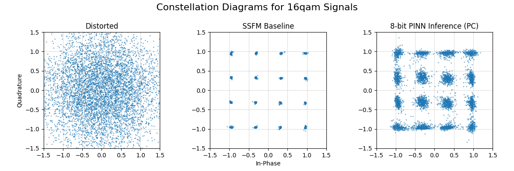
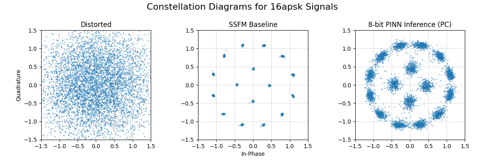
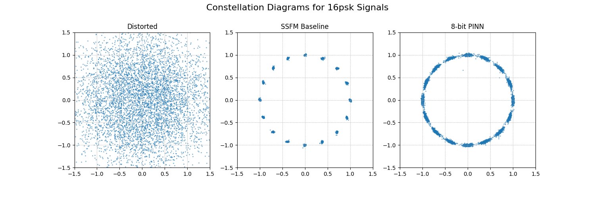
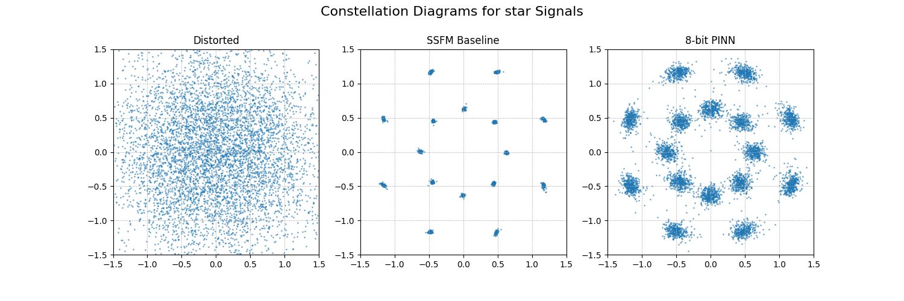
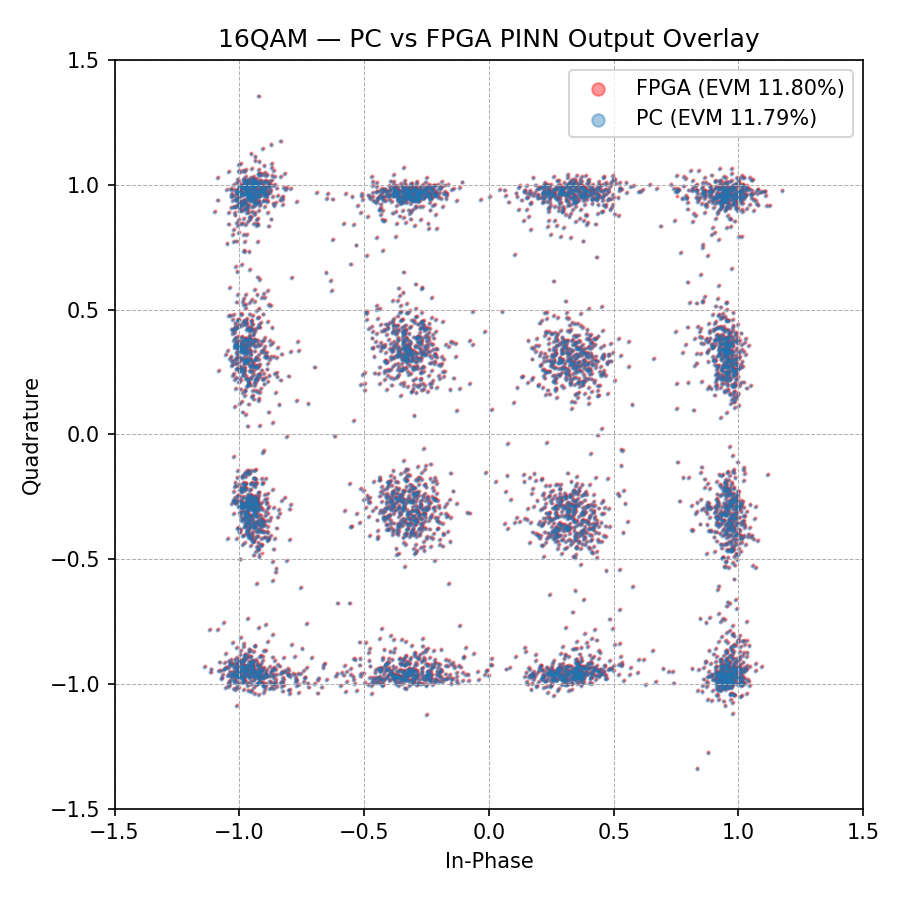
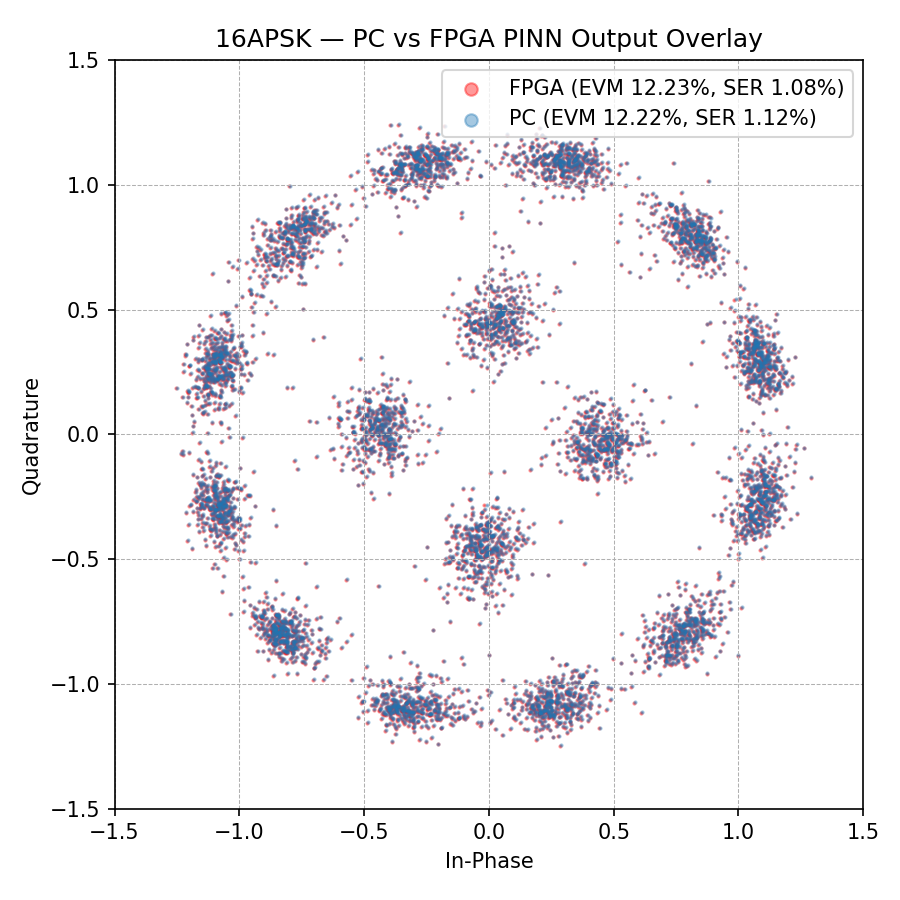
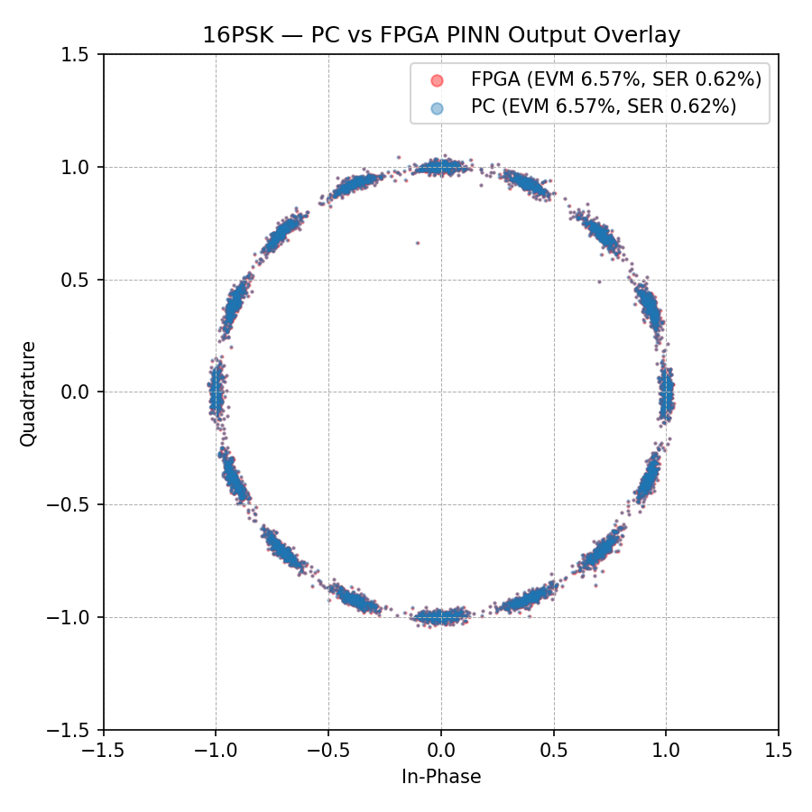
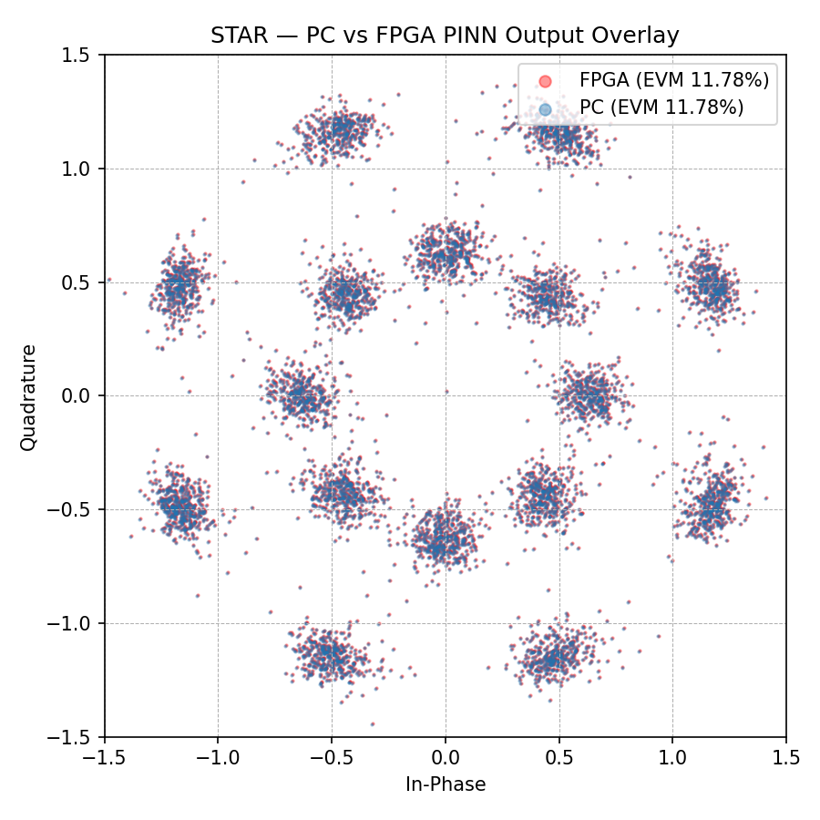

# FPGA-Accelerated Physics Informed Neural Network for Optical Fibre Communications

This script trains a Physics Informed Neural Network (PINN) to recover various modulated signals received at the endpoint through optical fibre. Noise is introduced due to physical constraints described by the Non-Linear Schrodingers Equation (NLSE).

4 signal types are supported: 16-QAM, 16-APSK, 16-PSK and STAR-QAM

## Physics Background

The NLSE describes pulse propagation in optical fiber:

```
A_z = i * (beta2/2) * A_tt + i * gamma * |A|^2 * A
```

where `A(z,t)` is the complex envelope, `beta2` is the group-velocity dispersion parameter, and `gamma` is the Kerr nonlinear coefficient. Ground-truth solutions are generated via the symmetric Split-Step Fourier Method (SSFM).

## Project Structure

```
PINN_FPGA_Project_Core/
├── createPINN.py                    # Base script for training PINN for all supported modulation types
├── trainPINN.py                     # [Default Entry Point] Reinforcement training script for PINNs
├── benchmark.py                     # Script to run Pytorch benchmark on trained network
├── cwd.check                        # Check file for scripts
├── req.txt                          # Requirements to run complex pinn script (CUDA 13 systems)
├── req_noncuda.txt                  # Requirements to run complex pinn script (non-CUDA systems)
│
├── consolidate/                     # Folder containing functions required for training/evaluating PINN
│   ├── __init__.py
│   ├── config.py                    # Class constructor, SSFM, training function
│   ├── helper.py                    # Helper functions, such as signal aligning
│   ├── sigClassify.py               # Signal classification functions
│   ├── sigGen.py                    # Signal generation functions
│   └── trainEval.py                 # Training loss/accuracy evaluation functions
│
├── pynq-zu/                         # Files related to deployment on PYNQ-ZU FPGA accelerator
│
├── sample_results/                  # Folder containing sample results for various signal types + saved/accelerator inputs
│   └── {sig_type}/                  # One folder per signal type (16apsk, 16psk, 16qam, star)
│       ├── complex_pinn_checkpoint.pth   # Trained model weights
│       ├── generated_inputs.pklv2        # Deterministic input snapshot — frozen random signal realisation
│       │                                 # ensuring PC and FPGA evaluate on the exact same data for a valid comparison
│       ├── accelerator_inputs.npy        # Same inputs quantised to int8 for FPGA consumption
│       └── ...                           # Metrics, constellation plots, ONNX exports, training performance
│
├── pc2fpga_eval/                    # PC-to-FPGA evaluation: combined metrics and overlay visualisation
│   ├── visualize_pc_vs_fpga.py      # Script to generate PC vs FPGA overlay constellation plot
│   └── {sig_type}_pc2fpga_eval_metrics.txt  # Per-signal combined report: PC results, FPGA results, degradation delta
│
├── qonnx2finn/                      # Folder containing function for FINN-ONNX export conversion
│   ├── qonnx2finn.py
│   └── req.txt                      # [Dependencies **ONLY IF** Running Independently]
│
└── README.md                        # This file
```

## Environment Setup
To run this complex quantization aware (QA) PINN training script, a Python virtual enviornment is required. **The expected Python version is 3.12.1.**
It is expected that all commands should run from the project root directory. To begin, create a virtual enviornment by the following:
```bash
python -m venv env
```
Activate the enviornment by the following:
```bash
./env/scripts/activate/ # Windows
./env/bin/activate/     # macOS/Linux
```
Install the required dependencies by the following:
```bash
pip install --no-deps --ignore-requires-python -r req.txt         # Designed for CUDA 13 Systems
pip install --no-deps --ignore-requires-python -r req_noncuda.txt # Designed for Non-CUDA Systems
```
Flags are required as there are dependency and python version conflicts between packages. This has been tested to be functional for the script.

> [!NOTE]
> The requirements file is specifcally designed for the use with a CUDA device, and has only been tested on CUDA workflows on Windows 11 with Python 3.12.1. There is no guarentee that it will function on other setups.

## Quick Start
To begin, simply run the script by calling:
```bash
python createPINN.py --sig_type {sig_type}
```
This will invoke training from scratch and will generate all available outputs (including metrics, visuals, checkpoints and exports). {sig_type} should contain the signal type required from: ``16qam``, ``16apsk``, ``16psk`` and ``star``. If blank, it will default to ``16qam``.

Additional CLI options are available. Please run:
```bash
python createPINN.py --help
```
for more information.

## Reinforcement Training Quick Start
In order for the network to be able to predict the recovery for different input 16-QAM, reinforcement training is required. This can be done by calling:
```bash
python trainPINN.py --sig_type {sig_type}
```
This will invoke an initial 3000 epoch training, then reinforcement training of ``x`` iterations at ``y`` epochs each, based on either default or CLI inputs. Defaults are ``15`` iterations at ``350`` epochs each. {sig_type} should contain the signal type required from: ``16qam``, ``16apsk``, ``16psk`` and ``star``. If blank, it will default to ``16qam``.

Additional CLI options are available. Please run:
```bash
python trainPINN.py --help
```
for more information.

## Generating deterministic inputs for accelerator, comparison and evaluation
To run the PINN on the accelerator, inputs must be specifically generated to match the required format for the PYNQ-ZU. Additionally, this input signal must be deterministic such that the results can be directly compared with the results from the SSFM-baseline and PINN on the computer. This input can be generated and saved by calling:
```bash
python createPINN.py --load True --save_inputs True --onnx_export False --finn_convert False --sig_type {sig_type}
```
{sig_type} should specify the same signal as the loaded model checkpoint. No error will be thrown if incorrect, but it may lead to incorrect results. This requires the trained network checkpoint, and generates ``generated_inputs.pklv2`` containing the generated and distorted input signal, and ``accelerator_inputs.npy`` containing the input signal in a format recognisable by the Python script written to execute the PINN on the accelerator. If required, the metrics for this input can be regenerated by calling:
```bash
python createPINN.py --load True --load_inputs True --onnx_export False --finn_convert False --sig_type {sig_type}
```
{sig_type} should specify the same signal as the loaded inputs and model checkpoint files. This will load the inputs and regenerate both the metrics and the visual. Note that whilst the network and inputs remain the same, the outputs can still differ due to non-determinstic behavior in pytorch.

> [!NOTE]
> The reinforcement training script will automatically generate the inputs. There is no need to run the command separately to generate the input files.

## Benchmarking
To run benchmarking on the trained networks, ensure that both the trained network checkpoint (``.pth``) and generated inputs (``.pklv2``) files are available. Run the benchmarking script by calling:
```bash
python benchmark.py --device {device} --dir {dir} --load_file {load_file} --inputs_file {inputs_file}
```
Replace the appropriate variables in curly brackets with appropriate values. {device} accepts either "cpu" or "cuda", with "cpu" being the default fallback. {dir} should be the directory to the folder containing the model checkpoint and generated inputs file, relative to the current working directory. {load_file} and {inputs_file} should be the name of the respective checkpoint (.pth) and generated inputs (.pklv2) files. Results are saved as plain text in the ``benchmark.log`` log file.

## PC to FPGA Evaluation

The `pc2fpga_eval/` folder contains tools for comparing model performance between PC inference and FPGA-accelerated inference on the same deterministic inputs.

### Combined Metrics

Each `{sig_type}_pc2fpga_eval_metrics.txt` file combines results from both platforms side-by-side, including:
- **PC Results**: EVM and SER for the distorted signal, SSFM baseline, and PINN on PC
- **FPGA Results**: EVM and SER for the PINN on the FPGA accelerator
- **Degradation Delta**: the difference (FPGA − PC) for each metric

### Overlay Constellation Visualisation

To generate an overlay scatter plot comparing PINN predictions from the PC and FPGA on the same signal, run:

```bash
python pc2fpga_eval/visualize_pc_vs_fpga.py --sig_type {sig_type}
```

This loads the pre-trained checkpoint and deterministic inputs from `sample_results/{sig_type}/`, runs PC inference, dequantises the FPGA output from `pynq-zu/_deployment/20260322_complex_v3/results/`, and saves `pc2fpga_eval/{sig_type}_pc_vs_fpga_overlay.png` showing both point clouds overlaid on one constellation diagram (PC in blue, FPGA in red). EVM and SER for both platforms are printed to the console.

Additional CLI options:
```bash
python pc2fpga_eval/visualize_pc_vs_fpga.py --help
```

> [!NOTE]
> This script requires the pre-trained checkpoint and `generated_inputs.pklv2` in `sample_results/{sig_type}/`, and the FPGA `output_0.npy` in the deployment results folder. No training is needed — all artefacts are pre-existing in `sample_results/`.

## Architecture

The architecture of the model is as follows:

```
Input (W×2) → QuantIdentity → QuantLinear(W×2 → H) → QuantHardTanh
            → QuantIdentity → QuantLinear(H → H)   → QuantHardTanh  (×L)
            → QuantIdentity → QuantLinear(H → 2)   → Output (Re, Im)

W = window_size (25), H = hidden_dim (64), L = hlayers (3)
```

The input takes a flattened sliding window of complex symbols, doubled to account for both ``Re`` and ``Im`` components. The model uses `QuantHardTanh` instead of `Tanh` as FINN is unable to synthesize `nn.Tanh` (or `qnn.QuantTanh`) into hardware logic. `QuantHardTanh` clamps outputs to [-1, 1] and fuses the activation with requantization into a single FINN-synthesizable node. A `QuantIdentity` layer at the input quantizes the incoming (z, t) values before the first linear layer. The final linear layer funnels the 64-wide hidden dimension down to an output size of 2, representing the single corrected real and imaginary values of the target symbol.

## Output Metrics/Visuals

Running the model provides 2 sets of metrics and 1 set of visualisation. The metrics include EVM (Error Vector Magnitude) and SER (Symbol Error Rate). The visualisation shows the distorted, SSFM-recovered and PINN-recovered constellation diagram of the modulated signal, with symbols normalised.

## Default Hyperparameters

| Parameter | Value | Description |
|-----------|-------|-------------|
| `epochs` | 3,000 | Training epochs |
| `lr` | 5e-4 | Learning rate |
| `bit_width` | 8 | Weight quantization bits |
| `act_bit_width` | 8 | Activation quantization bits |
|`reinforcement_iterations`|15|Iterations for reinforcement training|
|`reinforcement_epochs`|350|Training epochs for reinforcement training|

## Results

### Signal Recovery
Sample results are generated using default parameters with the reinforcement training ``trainPINN.py`` script. The following visuals were generated, illustrating the successful recovery of modulated signals.






### PC to FPGA Comparison
The following overlay plots compare PINN predictions from PC inference (blue) against FPGA-accelerated inference (red) on the same deterministic input signal. Generated by `pc2fpga_eval/visualize_pc_vs_fpga.py`.

<table>
  <tr>
    <td align="center">
      
      <br>16QAM
    </td>
    <td align="center">
      
      <br>16APSK
    </td>
    <td align="center">
      
      <br>16PSK
    </td>
    <td align="center">
      
      <br>Star
    </td>
  </tr>
</table>
